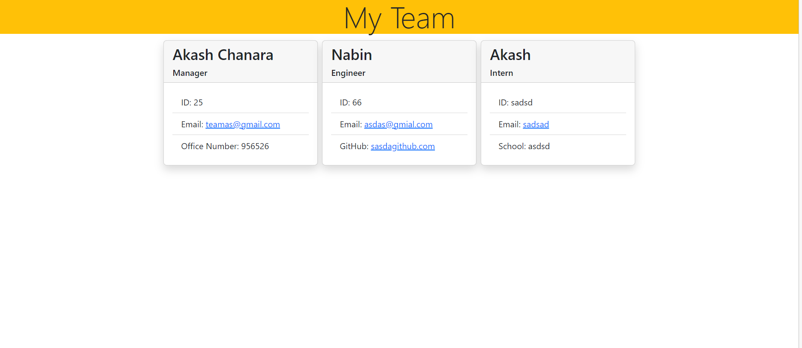
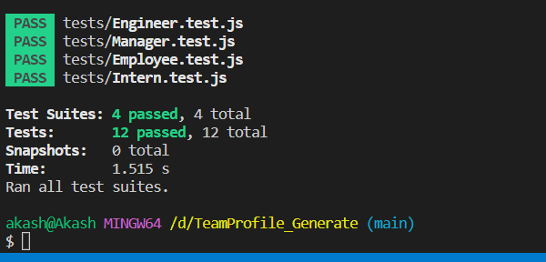

# TeamProfile_Generate

# Home pages



# Jest test



## User Story

GIVEN a command-line application that accepts user input
WHEN I am prompted for my team members and their information
THEN an HTML file is generated that displays a nicely formatted team roster based on user input
WHEN I click on an email address in the HTML
THEN my default email program opens and populates the TO field of the email with the address
WHEN I click on the GitHub username
THEN that GitHub profile opens in a new tab
WHEN I start the application
THEN I am prompted to enter the team manager’s name, employee ID, email address, and office number
WHEN I enter the team manager’s name, employee ID, email address, and office number
THEN I am presented with a menu with the option to add an engineer or an intern or to finish building my team
WHEN I select the engineer option
THEN I am prompted to enter the engineer’s name, ID, email, and GitHub username, and I am taken back to the menu
WHEN I select the intern option
THEN I am prompted to enter the intern’s name, ID, email, and school, and I am taken back to the menu
WHEN I decide to finish building my team
THEN I exit the application, and the HTML is generated

## Summary

This application uses node.js, fs, and inquirer to create prompts for the user to fill out and then construct team profile markdown

## Installation:

You need to make sure node.js, util, fs and inquirer instaled before you run the application.

```Code
npm init -y
npm i inquirer@8.2.4
```

## Usage

This application allows for a user to generate a Teamprofile.

## Project Demo


## Github[https://github.com/akash2040/TeamProfile_Generate]
